<!-- README.md is generated from README.Rmd. Please edit that file -->

# ggrapid: Create neat & complete ggplot visualizations with as little code as possible

## Overview

ggrapid enables creation of the most common ggplot-based visualizations
fast and with just a few lines of code. In practice the package offers
wrappers of some of the most common ggplot geoms such as: geom\_density,
geom\_boxplot, geom\_bar etc. ggrapid comes handy when you’d like to do
an initial and quick EDA (Exploratory Data Analysis) over various
columns of your dataset programatically, without the need of writing a
lot of custom ggplot code.

## Installation

``` r
# Install development version from GitHub
devtools::install_github("konradsemsch/ggrapid")
```

## Main functions

ggrapid offers a couple wrappers around the most commonly used functions
in the course of doing an EDA:

  - `plot_density`
  - `plot_boxplot`
  - `plot_deciles` (with `calculate_decile_table`)
  - `plot_correlation`
  - `plot_bars`
  - `plot_line`

#### Density plot

``` r
diamonds %>%
  plot_density(x = carat)
```

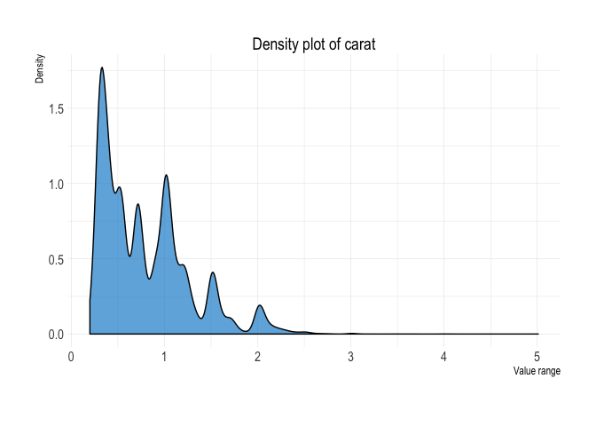<!-- -->

#### Box-plot

``` r
diamonds %>%
  plot_boxplot(x = cut,
               y = carat,
               fill = cut)
```

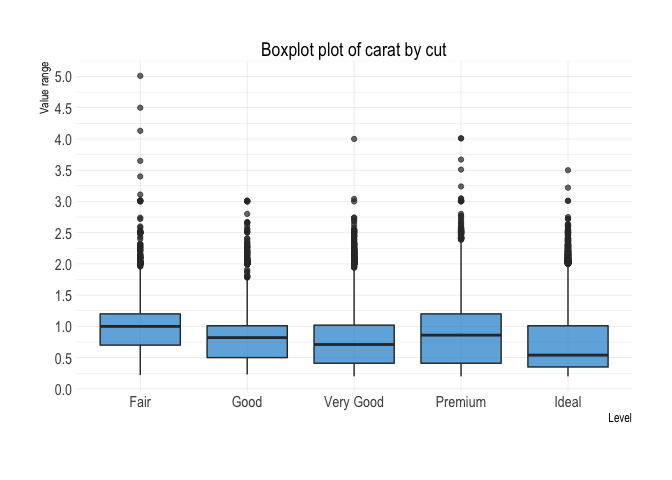<!-- -->

#### Decile plot

``` r
diamonds %>% 
  filter(cut %in% c("Ideal", "Premium")) %>% 
  calculate_decile_table(price, cut, "Ideal") %>%
  plot_deciles()
```

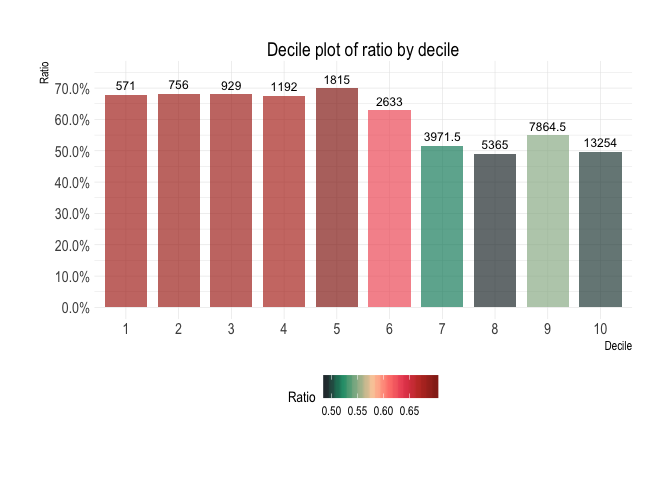<!-- -->

#### Correlation

``` r
diamonds %>%
  plot_correlation()
```

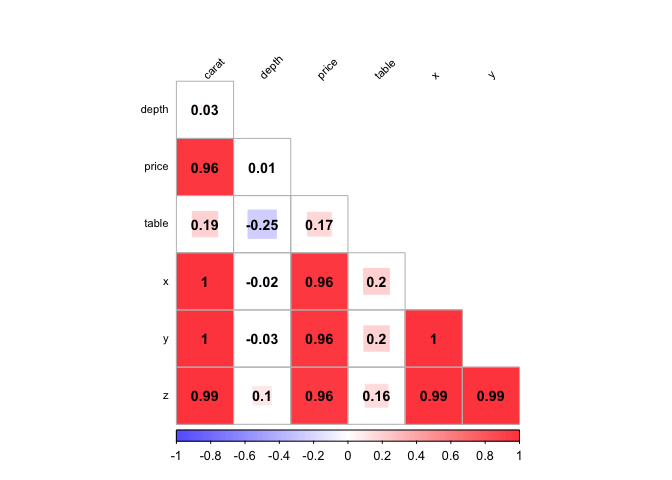<!-- -->

#### Barplot

``` r
diamonds %>%
  plot_bars(x = carat,
            x_type = "num",
            fill = cut)
```

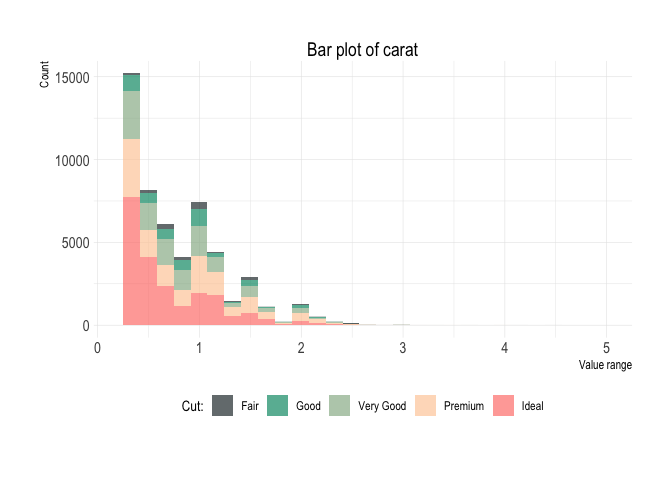<!-- -->

#### Lineplot

``` r
tibble(
  time = 1:20,
  value = rnorm(20, 0.5, 2)
  ) %>%
  plot_line(
    x = time,
    y = value
  )
```

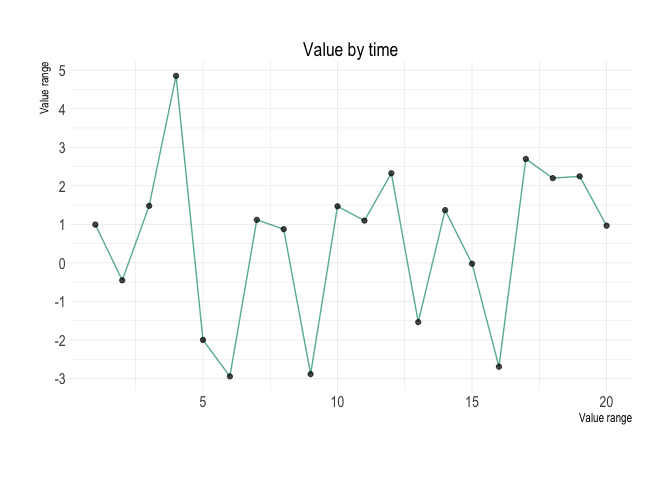<!-- -->

## Main arguments

The most commonly implemented ggplot2 arguments across all main ggrapid
functions ensure that you can build your basic EDA file without making
additional changes or custom functions. Those arguments are mainly
(might slightly differ across functions):

  - fill
  - facet
  - position
  - ticks
  - angle
  - title
  - subtitle
  - caption
  - lab\_x
  - lab\_y
  - legend
  - vline/ hline
  - alpha
  - quantile\_low
  - quantile\_high
  - theme\_type
  - palette

<!-- end list -->

``` r
diamonds %>%
  plot_density(x = carat)
```

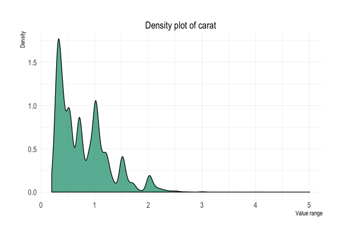<!-- -->

``` r
diamonds %>%
  plot_density(x = carat,
               fill = cut,
               position = "stack")
```

<!-- -->

``` r
diamonds %>%
  plot_density(x = carat,
               fill = cut,
               position = "fill")
```

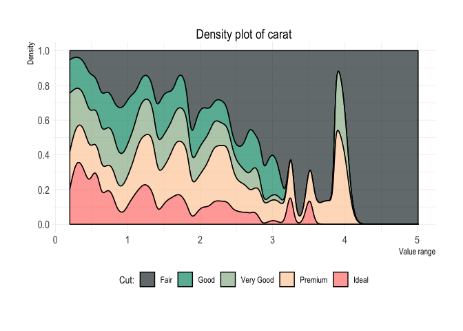<!-- -->

``` r
diamonds %>%
  plot_density(x = carat,
               fill = cut,
               facet = cut,
               title = "Write your title here",
               subtitle = "Write your subtitle here",
               caption = "Write your caption here",
               lab_x = "Carat",
               alpha = .5,
               vline = 1)
```

<!-- -->

## Complete usage

You can easily iterate across selected columns and create a set of plots
for your EDA file:

``` r

library(recipes)

credit_data_nested <- credit_data %>% 
  select(-one_of("Home", "Marital", "Records", "Job")) %>% # removing categorical variables
  gather(variable, variable_value,
         one_of("Seniority", "Time", "Age", "Expenses", # selecting variables to gather
                "Income", "Assets", "Debt", "Amount", "Price")) %>% 
  nest(-variable) %>% 
  mutate(
    decile_table = map(data, 
                       ~calculate_decile_table(
                         .x,
                         binning = variable_value,
                         grouping = Status,
                         top_level = "bad",
                         format = FALSE
                         )
    ),
    plot_deciles  = pmap(list(x = decile_table, y = variable),
                         ~plot_deciles(
                           .x,
                           title = glue::glue("Decile plot of {.y}"),
                           quantile_low = 0, 
                           quantile_high = 1, 
                           lab_x = "Decile",
                           lab_y = "Bad rate, %"
                           )
    ),
    plot_boxplot  = pmap(list(x = data, y = variable),
                         ~plot_boxplot(
                           .x,
                           x = Status,
                           y = variable_value,
                           fill = Status,
                           title = glue::glue("Box plot of {.y} by Status"),
                           quantile_low = 0.01,
                           quantile_high = 0.99,
                           lab_x = "Performance",
                           caption = "Removed 1% of observations from each side",
                           palette = "inv_binary"
                           )
    ),
    plot_density  = pmap(list(x = data, y = variable),
                     ~plot_density(
                       .x,
                       x = variable_value,
                       fill = Status,
                       title = glue::glue("Box plot of {.y} by Status"),
                       quantile_low = 0.01,
                       quantile_high = 0.99,
                       lab_x = "Performance",
                       caption = "Removed 1% of observations from each side",
                       palette = "inv_binary"
                       )
    )
  )
```

This will give you the following structure. Each row represents an
individual variable and columns are the different plots you would like
to inspect:

``` r
credit_data_nested[1:3, ]
#> # A tibble: 3 x 6
#>   variable  data       decile_table  plot_deciles plot_boxplot plot_density
#>   <chr>     <list>     <list>        <list>       <list>       <list>      
#> 1 Seniority <tibble [… <tibble [10 … <gg>         <gg>         <gg>        
#> 2 Time      <tibble [… <tibble [10 … <gg>         <gg>         <gg>        
#> 3 Age       <tibble [… <tibble [10 … <gg>         <gg>         <gg>
```

## Exemplary EDA format

Creating a standardised EDA file is just as easy as doing something like
this:

### Variable: Seniority

#### Decile analysis

``` r
credit_data_nested$decile_table[[1]]
#> # A tibble: 10 x 8
#>    decile   min median   max top_level total bottom_level ratio     
#>    <fct>  <dbl>  <dbl> <dbl>     <int> <int>        <int> <formttbl>
#>  1 1          0      0     0       235   446          211 52.69%    
#>  2 2          0      1     1       209   445          236 46.97%    
#>  3 3          1      2     2       174   446          272 39.01%    
#>  4 4          2      3     3       146   445          299 32.81%    
#>  5 5          3      4     5       122   445          323 27.42%    
#>  6 6          5      6     8       105   446          341 23.54%    
#>  7 7          8     10    10        88   445          357 19.78%    
#>  8 8         10     12    14        76   446          370 17.04%    
#>  9 9         14     16    20        54   445          391 12.13%    
#> 10 10        20     25    48        45   445          400 10.11%
```

``` r
credit_data_nested$plot_deciles[[1]]
```

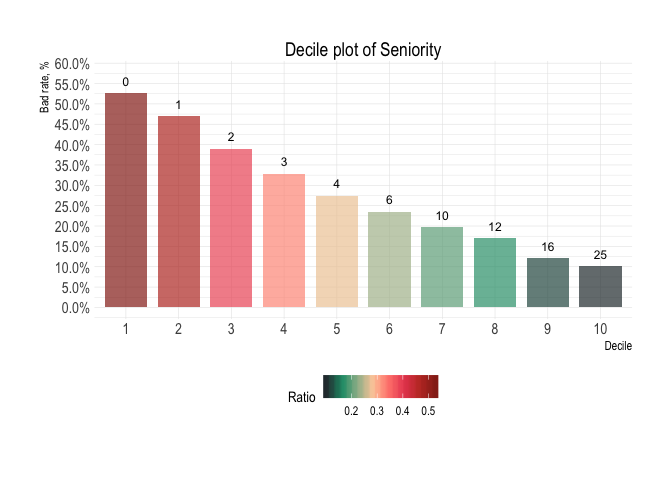<!-- -->

#### Aditional plots

``` r
credit_data_nested$plot_boxplot[[1]]
```

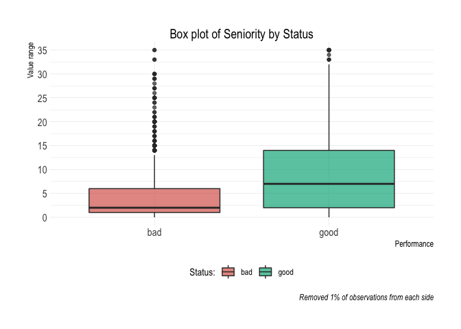<!-- -->

``` r
credit_data_nested$plot_density[[1]]
```

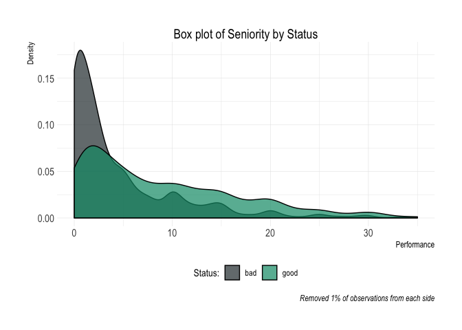<!-- -->

### Variable: Time

#### Decile analysis

``` r
credit_data_nested$decile_table[[2]]
#> # A tibble: 10 x 8
#>    decile   min median   max top_level total bottom_level ratio     
#>    <fct>  <dbl>  <dbl> <dbl>     <int> <int>        <int> <formttbl>
#>  1 1          6     18    24        64   446          382 14.35%    
#>  2 2         24     30    36       109   445          336 24.49%    
#>  3 3         36     36    36       124   446          322 27.80%    
#>  4 4         36     36    48       136   445          309 30.56%    
#>  5 5         48     48    48       135   445          310 30.34%    
#>  6 6         48     48    60       125   446          321 28.03%    
#>  7 7         60     60    60       133   445          312 29.89%    
#>  8 8         60     60    60       155   446          291 34.75%    
#>  9 9         60     60    60       129   445          316 28.99%    
#> 10 10        60     60    72       144   445          301 32.36%
```

``` r
credit_data_nested$plot_deciles[[2]]
```

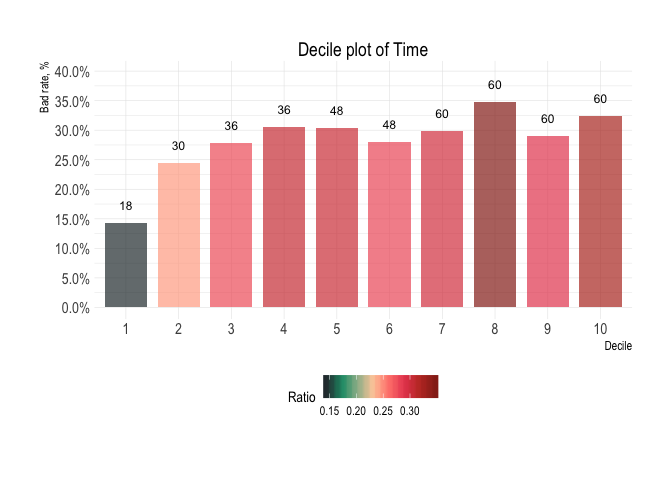<!-- -->

#### Aditional plots

``` r
credit_data_nested$plot_boxplot[[2]]
```

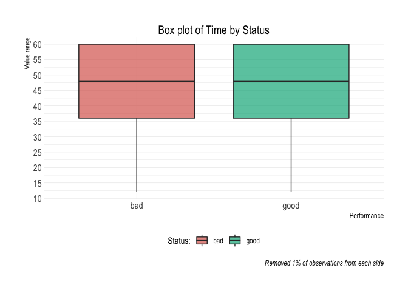<!-- -->

``` r
credit_data_nested$plot_density[[2]]
```

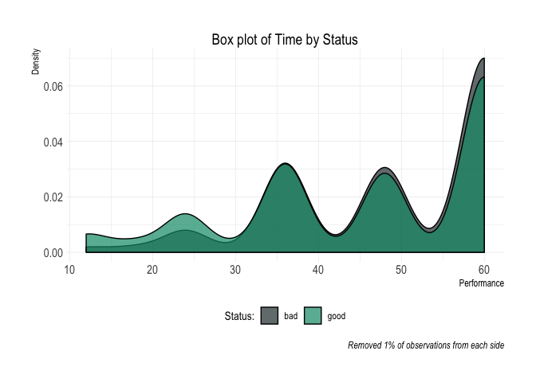<!-- -->
